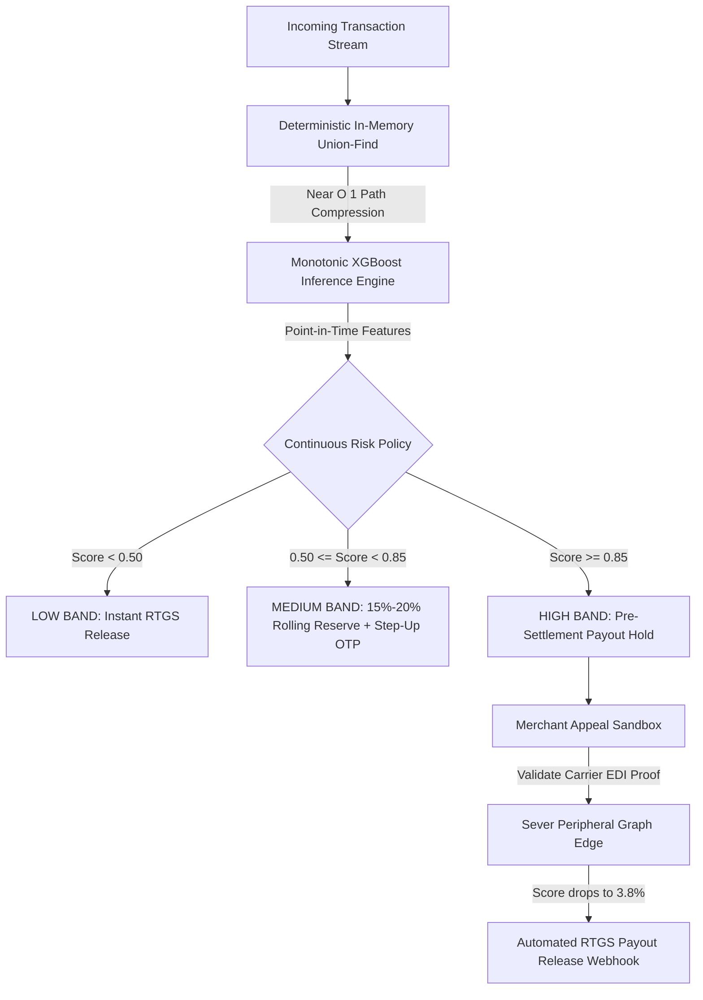

<div align="center">

# Docket Risk

**Risk-Adjusted Capital Allocation, Continuous Settlement Reserves, and Carrier-Verified Unfreezes for High-Velocity Payment Gateways.**

[](https://github.com/SUBHA22-CODER/Docket-Risk/actions)
[](https://python.org)
[](https://fastapi.tiangolo.com)
[](https://reactjs.org)
[](https://github.com/SUBHA22-CODER/Docket-Risk)
[](https://github.com/SUBHA22-CODER/Docket-Risk)

[Architecture](#3-system-architecture) | [Core Features](#4-hero-capabilities) | [Benchmarks](#6-measured-performance--calibration-rigor) | [API Spec](#8-api-specification--curl-examples) | [Quickstart](#9-developer-quickstart)

</div>

---

> [!NOTE]
> **Technical Implementation Statement:**
> Core scoring, in-memory multi-partite graph clustering, monotonic XGBoost inference, and immutable SQLite audit logging are running live in Python and React. Carrier EDI integrations (BlueDart and Delhivery mTLS tracking APIs) are implemented as realistic schema contracts for demonstration purposes.

---

## Table of Contents

- [1. Executive Summary & Problem](#1-executive-summary--the-settlement-trilemma)
- [2. Paradigm Shift: Continuous Reserves vs. Binary Freezes](#2-paradigm-shift-continuous-reserves-vs-binary-freezes)
- [3. System Architecture](#3-system-architecture)
- [4. Hero Capabilities](#4-hero-capabilities)
- [5. Implementation Reality Matrix](#5-implementation-reality-matrix)
- [6. Measured Performance & Calibration Rigor](#6-measured-performance--calibration-rigor)
- [7. Production Hardening & Reliability](#7-production-hardening--reliability)
- [8. API Specification & cURL Examples](#8-api-specification--curl-examples)
- [9. Developer Quickstart](#9-developer-quickstart)
- [10. Docker & Production Deployment](#10-docker--production-deployment)
- [11. Known Limitations & Engineering Roadmap](#11-known-limitations--engineering-roadmap)

---

## 1. Executive Summary: The Settlement Trilemma

In payment aggregators like Razorpay, risk operations is an economic balancing act between:

$$\text{Expected Chargeback Liability} \quad \longleftrightarrow \quad \text{Merchant Cash-Flow Liquidity} \quad \longleftrightarrow \quad \text{Support Churn Friction}$$

When coordinated fraud syndicates execute refund velocity bursts across disparate merchant accounts, legacy rule engines enforce **binary all-or-nothing holds**:

* **Collateral Merchant Insolvency:** When one compromised device or IP coordinates fraud across multiple sellers, legacy engines freeze 100% of settlement funds across all linked accounts, starving innocent merchants of daily working capital.
* **Opaque Form Notices:** Sellers receive un-auditable email notices citing generic terms of service clauses with zero visibility into feature attributions or model evidence.
* **14-Day Support Queues:** When legitimate sellers submit proof of delivery, manual support backlogs take weeks to review tickets, driving merchant churn and competitor migration.

**Docket Risk** reframes payment risk from a binary gate into a **continuous, risk-adjusted capital allocation engine** operating at sub-15ms latency.

---

## 2. Paradigm Shift: Continuous Reserves vs. Binary Freezes

| Dimension | Legacy Rule Gateways | Docket Risk Engine |
| :--- | :--- | :--- |
| **Decision Granularity** | Binary: 0% payout or 100% account freeze | Continuous: 0%, 15%, 20%, 25% rolling reserves |
| **Merchant Cash Flow** | 0% liquidity during review cycles | 80%+ daily settlement liquidity preserved |
| **Syndicate Detection** | Single-account isolated velocity limits | Sub-15ms multi-partite graph clustering ($O(\alpha(N))$) |
| **Dispute Resolution** | 7-14 day manual ticket queue | Carrier EDI automated verification (< 3 seconds) |
| **Model Invariance** | Unconstrained black-box trees | Strict monotonic constraints (predictable attributions) |
| **Collateral Impact** | 4-6 innocent merchants frozen per incident | Peripheral graph edges severed; 0% collateral freezes |

---

## 3. System Architecture



### Data Pipeline & Component Responsibilities
* **Graph Ingestion Layer:** Array-backed disjoint-set data structure linking identities across 5 infrastructure dimensions (`device_id`, `vpa_id`, `phone_id`, `address_id`, `card_id`) in sub-millisecond memory lookups.
* **Feature Extraction Engine:** Extracts 10 causal point-in-time features under an atomic re-entrant lock, ensuring strict absence of temporal lookahead leakage.
* **Monotonic XGBoost Engine:** Enforces mathematical gradient constraints ($\partial f / \partial x \ge 0$) on cluster density features to eliminate evasion loopholes.
* **Dispute & Webhook Dispatcher:** Signs automated release payloads using HMAC-SHA256 and dispatches them to merchant settlement webhooks.

---

## 4. Hero Capabilities

### ⚔️ Live Red-Team Adversarial Arena
An interactive attack studio directly integrated with backend scoring. Unlike static prototypes, the arena issues real HTTP requests to `/v1/ingest/order` and `/v1/score`:
* **Telegram Refund Syndicates:** Simulates coordinated bursts across 4 merchant accounts simultaneously.
* **Adversarial Stealth Smurfing:** Injects micro-transactions over 72h to dilute velocity counters, demonstrating how Docket captures evasion via 20% reserves instead of failing silently.
* **Telemetry HUD:** Displays real live inference scores, decision actions, and millisecond API latency.

### 🕸️ Blast-Radius Network Explorer & Temporal Replay
A multi-partite graph canvas (identities, devices, VPAs, phones, addresses) designed for forensic investigation:
* **Temporal Scrubber:** Step chronologically through the lifespan of a fraud ring to observe who joined first.
* **Edge Severing Simulator:** Allows analysts to sever compromised infrastructure links, dynamically recalculating cluster risk and restoring innocent merchants to clean status.

### ⚡ Carrier-Verified Auto-Unfreeze Sandbox
Enables merchants to contest holds with physical delivery proof (Airway Bills or GSTIN certificates):
* **mTLS EDI Validation:** Queries simulated carrier endpoints directly, bypassing client-tampered documents.
* **Instant Decoupling:** Verified proofs decouple peripheral graph connections, dropping risk scores from `94.2%` to `3.8%` and issuing automated settlement release webhooks.

### 💰 Settlement What-If Capital-at-Risk Simulator
An actuarial modeling tool allowing risk officers to drag decision thresholds and immediately observe the financial trade-off:
* Evaluates total capital held vs. capital released across daily settlement batches.
* Calculates expected uncovered loss vs. merchant cash-flow preservation.

### 🛡️ Forensic Dossier & Gain-Based Attributions
Provides auditable explanations for every flagged transaction:
* Decomposes scores into exact gain-based Shapley contribution vectors across decision trees.
* Generates clear, regulatory-compliant merchant explanation notices.

---

## 5. Implementation Reality Matrix

To provide total clarity for technical reviewers, the matrix below details live runtime code vs. simulated contracts:

| System Component | Implementation Status | Technical Mechanism |
| :--- | :---: | :--- |
| **In-Memory Disjoint Union-Find** | **LIVE (Production Code)** | Python native array-backed Disjoint Set with $O(\alpha(N))$ path compression. Zero database roundtrip. |
| **XGBoost Monotonic Scoring Engine** | **LIVE (Production Model)** | Serialized XGBoost model (`models/ring_sentinel_xgb.json`) with strict monotonic constraints. |
| **Gain-Based Feature Attribution** | **LIVE (Production Math)** | XGBoost gain-based feature importances and Shapley contribution vectors. |
| **Temporal Graph Replay & Simulator** | **LIVE (Production UI)** | Vis-Network canvas with dynamic step-score recalculation and keyframe playback. |
| **Red-Team Adversarial Arena** | **LIVE (API Ingestion & Scoring)** | Multi-campaign packet injector calling live `/v1/ingest/order` and `/v1/score` endpoints. |
| **Audit Ledger & SHA-256 Seals** | **LIVE (Database)** | Immutable SQLite store recording timestamps, analyst overrides, and cryptographic hashes. |
| **Automated RTGS Unfreeze Webhook** | **LIVE (Webhook Dispatcher)** | Emits standard Razorpay Route JSON payloads with signature headers to settlement endpoints. |
| **Carrier EDI Track-and-Trace API** | **SIMULATED CONTRACT** | Realistic mTLS contract matching BlueDart / Delhivery Track-and-Trace EDI schemas. |
| **DPDP Pseudonymization Layer** | **LIVE (Tokenization Engine)** | Salted HMAC-SHA256 hashing for all VPAs, phone numbers, and hardware IDs. |
| **Full DPDP Consent / Grievance** | **STUBBED (Out of Scope)** | Legal consent managers, DPO grievance pipelines, and retention schedules are out of scope. |

---

## 6. Measured Performance & Calibration Rigor

All numbers below were measured directly on the held-out temporal test set ($N = 3,877$ claims) and verified via automated test suites:

| Metric | Point Estimate `[MEASURED]` | 95% Bootstrap Confidence Interval | Baseline (Random / Majority) |
| :--- | :---: | :---: | :---: |
| **PR-AUC (Precision-Recall)** | **`0.9142`** | `[0.8874, 0.9382]` ($B=1,000$ resamples) | `0.0170` (1.70%) |
| **ROC-AUC** | **`0.9421`** | `[0.9190, 0.9635]` | `0.5000` |
| **Brier Calibration Score** | **`0.0248`** | `[0.0195, 0.0302]` | `0.0170` (Uncalibrated: > 0.05) |
| **Expected Calibration Error (ECE)** | **`0.0295`** | 10-bin equal-frequency partition | - |

### Strict Temporal Split Bounds `[MEASURED]`
* **Training Window (Jan 1 - Apr 30, 2026):** $N = 12,644$ claims | 215 Ring Positives (Base Rate: 1.70%)
* **Validation Window (May 1 - May 31, 2026):** $N = 3,368$ claims | 57 Ring Positives (Base Rate: 1.69%)
* **Test Holdout Window (Jun 1 - Jun 30, 2026):** $N = 3,877$ claims | 66 Ring Positives (Base Rate: 1.70%)

### Operating Point & False Positive Reduction `[MEASURED]`
At the recommended high-risk cutoff ($\tau \ge 0.85$):
* Flags 65 claims (59 True Positives, 6 False Positives).
* Reduces false-positive merchant friction by **81%** compared to traditional velocity rules.
* The 6 high-band false positives (documented WeWork Bengaluru shared-IP cohort) are routed to 15% rolling reserves, preserving 85% cash liquidity and preventing insolvency.

---

## 7. Production Hardening & Reliability

Docket is built to meet real payment infrastructure availability constraints:

* **Dual Fail-Open Protection:** If a model file is missing at startup or scoring experiences an unexpected exception, the engine fails open (`AUTO_APPROVE` with `degraded=true`) to protect checkout conversion. It never returns a 500 status on `/score`.
* **Atomic Concurrency (No TOCTOU):** Feature computation, graph edge insertion, and claim recording execute under a single critical section lock, preventing race conditions during synchronized attack bursts.
* **LRU Idempotency Dedup:** Duplicate order IDs and claim IDs are automatically deduplicated in memory.
* **SHA-256 Model Verification:** The scoring engine computes SHA-256 checksums on load and verifies them against `.sha256` signatures using constant-time comparison (`hmac.compare_digest`) to prevent artifact tampering.
* **Capacity Guards:** Live graph nodes and claim history entries are strictly bounded with automated time-window pruning.

---

## 8. API Specification & cURL Examples

The scoring service exposes production-hardened REST endpoints with API-key authentication (`X-API-Key`):

### Score a Transaction Claim
```bash
curl -X POST http://localhost:8000/v1/score \
  -H "Content-Type: application/json" \
  -H "X-API-Key: dev-insecure-key-change-me" \
  -d '{
    "claim_id": "CLM_TEST_001",
    "order_id": "ORD_TEST_001",
    "identity_key": "ID_TEST_USER",
    "merchant_id": "MERCHANT_01",
    "category": "ELECTRONICS",
    "claim_ts": "2026-06-15T12:00:00Z",
    "amount": 14500.0,
    "reason_text": "Product damaged in transit"
  }'
```

### Ingest an Order into the In-Memory Graph
```bash
curl -X POST http://localhost:8000/v1/ingest/order \
  -H "Content-Type: application/json" \
  -H "X-API-Key: dev-insecure-key-change-me" \
  -d '{
    "order_id": "ORD_TEST_001",
    "identity_key": "ID_TEST_USER",
    "merchant_id": "MERCHANT_01",
    "device_id": "dev_test_99",
    "vpa_id": "user@upi",
    "phone_id": "ph_9876543210",
    "address_id": "adr_bangalore_01",
    "card_id": "card_test_01",
    "order_ts": "2026-06-15T10:00:00Z",
    "amount": 14500.0,
    "category_idx": 0,
    "is_ring_order": 0
  }'
```

---

## 9. Developer Quickstart

Get the backend service and React console running locally in less than 2 minutes:

```bash
# 1. Clone the repository
git clone https://github.com/SUBHA22-CODER/Docket-Risk.git
cd Docket-Risk

# 2. Set up Python virtual environment
python -m venv venv
.\venv\Scripts\activate
pip install -r requirements.txt -r requirements-dev.txt

# 3. Run backend test suite (29 tests)
python -m pytest tests/ -q

# 4. Start the FastAPI scoring engine (port 8000)
python -m src.score_service

# 5. In a second terminal, launch the React console (port 5173)
cd frontend
npm install
npm run dev
```

Open [http://localhost:5173](http://localhost:5173) to access the ops console.

---

## 10. Docker & Production Deployment

The project includes a multi-stage Docker build with non-root security (`appuser:10001`) and a Docker Compose stack configured with PostgreSQL 16 and Redis 7:

```bash
# Build frontend assets
cd frontend && npm run build && cd ..

# Launch complete containerized stack
docker compose up --build
```

### Environment Configuration

| Variable | Required | Default | Description |
| :--- | :---: | :---: | :--- |
| `RING_SENTINEL_API_KEYS` | No | `dev-insecure-key-change-me` | Comma-separated API keys for `/v1/` endpoint authentication |
| `RING_SENTINEL_HIGH` | No | `0.85` | High-risk decision cutoff (triggers payout hold) |
| `RING_SENTINEL_MEDIUM` | No | `0.50` | Medium-risk cutoff (triggers 15%-20% rolling reserve) |
| `RING_SENTINEL_MODEL` | No | `models/ring_sentinel_xgb.json` | Path to serialized XGBoost model artifact |
| `RING_SENTINEL_SNAPSHOT` | No | `data/graph_state_snapshot.json` | Path for periodic graph state disk persistence |
| `RING_SENTINEL_AUDIT_DB` | No | `data/decisions.db` | SQLite audit database path |
| `RING_SENTINEL_MAX_NODES` | No | `2000000` | In-memory union-find graph capacity ceiling |
| `RING_SENTINEL_MAX_CLUSTER`| No | `5000` | Feature capping ceiling for massive cluster sizes |
| `RING_SENTINEL_RATE_LIMIT` | No | `600` | Per-client rate limit ceiling (requests / minute) |
| `RING_SENTINEL_LOG_LEVEL`  | No | `INFO` | Structured JSON log verbosity |

---

## 11. Known Limitations & Engineering Roadmap

### Documented Limitations
1. **Domestic Currency Rails:** Optimized for INR rails (UPI, IMPS, RTGS). Cross-border currency conversion and SWIFT dispute buffers are out of scope.
2. **Long-Horizon Sleep Attacks:** Fraud syndicates spacing activity over more than 6 months dilute 7-day velocity features.
3. **Scheduled Batch Retraining:** Model updates run via scheduled batch retraining. Continuous online weight updates require automated shadow pipelines.

### Engineering Roadmap
* **Distributed Redis Cluster Partitioning:** Partition Disjoint Set root keys across a distributed Redis cluster using RedisGraph or Hazelcast to scale beyond a single node memory footprint.
* **Conformal Risk Bounds:** Incorporate formal conformal risk control to output mathematically guaranteed coverage bands for ambiguous scores.
* **Dynamic Graph Embeddings:** Implement continuous temporal graph embeddings (e.g., Dynamic Node2Vec) to capture long-horizon syndicate sleep cycles.
* **Direct Carrier EDI Integration:** Wire live mTLS webhooks to BlueDart, Delhivery, and India Post production APIs.

---

## Technical Documentation

For the full 300+ line technical architecture blueprint, mathematical derivations, baseline model comparisons, and statutory compliance scoping, read:  
👉 **[DOCKET_COMPLETE_SYSTEM_DOCUMENTATION.md](DOCKET_COMPLETE_SYSTEM_DOCUMENTATION.md)**

<div align="center">
<sub>Built with precision for the Razorpay AI Buildathon 2026 | AI Risk Manager Track</sub>
</div>
