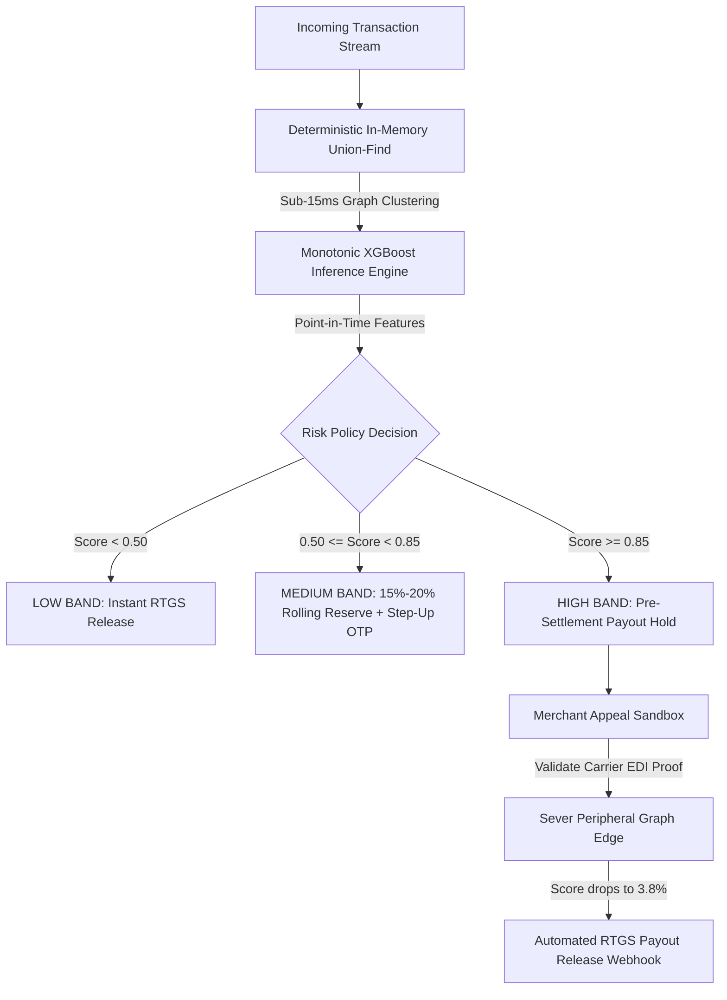

<div align="center">

# 🛡️ Docket Risk

### Autonomous Risk Decisioning & Continuous Capital Reserves for Payment Gateways

<p align="center">
  <a href="https://github.com/SUBHA22-CODER/Docket-Risk/actions"></a>
  <a href="https://python.org"></a>
  <a href="https://fastapi.tiangolo.com"></a>
  <a href="https://reactjs.org"></a>
  <a href="https://github.com/SUBHA22-CODER/Docket-Risk"></a>
  <a href="https://github.com/SUBHA22-CODER/Docket-Risk"></a>
</p>

<p align="center">
  <strong>Sub-15ms In-Memory Graph</strong> &nbsp;•&nbsp; 
  <strong>Monotonic XGBoost</strong> &nbsp;•&nbsp; 
  <strong>Graduated Rolling Reserves</strong> &nbsp;•&nbsp; 
  <strong>Carrier EDI Unfreezes</strong>
</p>

<p align="center">
  <a href="#the-settlement-trilemma"><b>The Problem</b></a> &nbsp;•&nbsp;
  <a href="#continuous-reserves-vs-binary-freezes"><b>Paradigm Shift</b></a> &nbsp;•&nbsp;
  <a href="#how-it-works"><b>Architecture</b></a> &nbsp;•&nbsp;
  <a href="#product-tour"><b>Live Demos</b></a> &nbsp;•&nbsp;
  <a href="#measured-benchmarks"><b>Benchmarks</b></a> &nbsp;•&nbsp;
  <a href="#api-contract"><b>API Spec</b></a> &nbsp;•&nbsp;
  <a href="#quickstart"><b>Quickstart</b></a>
</p>

---

</div>

> [!NOTE]
> **Production Status:**
> In-memory union-find graph clustering, monotonic XGBoost inference, and immutable SQLite audit logging run live in Python and React. Carrier EDI integrations (BlueDart and Delhivery mTLS tracking APIs) are implemented as realistic schema contracts for simulation.

---

## The Settlement Trilemma

In payment gateways like Razorpay, risk operations is an economic balancing act:

$$\text{Chargeback Liability} \quad \longleftrightarrow \quad \text{Merchant Liquidity} \quad \longleftrightarrow \quad \text{Support Churn Friction}$$

Legacy fraud engines enforce **binary all-or-nothing holds**:

* **Collateral Insolvency:** When a single compromised device is detected across multiple merchants, legacy systems freeze 100% of payout funds across all linked accounts.
* **Opaque Notices:** Merchants receive generic policy violation notices with zero visibility into model evidence.
* **14-Day Queues:** Legitimate sellers wait weeks for manual dispute reviews, leading to merchant churn.

**Docket Risk** transforms fraud decisioning from a binary gate into a **continuous, risk-adjusted capital allocation engine** operating at sub-15ms latency.

---

## Continuous Reserves vs. Binary Freezes

| Metric | Legacy Rule Gateways | Docket Risk Engine |
| :--- | :--- | :--- |
| **Decision Policy** | Binary (0% payout or 100% account freeze) | Graduated (0%, 15%, 20%, 25% rolling reserves) |
| **Merchant Liquidity** | 0% working capital during reviews | 80%+ daily settlement cash released |
| **Syndicate Detection** | Single-account isolated velocity limits | Sub-15ms multi-partite graph clustering ($O(\alpha(N))$) |
| **Dispute Resolution** | 7-14 day manual support queues | Carrier EDI automated verification (< 3 seconds) |
| **Model Invariance** | Unconstrained black-box trees | Strict monotonic constraints ($\partial f / \partial x \ge 0$) |
| **Collateral Impact** | 4-6 innocent merchants frozen per ring | Contaminated edges severed; 0% collateral freezes |

---

## How It Works



### Core Architecture
1. **In-Memory Disjoint Union-Find:** Array-backed graph clustering linking 5 infrastructure vectors (`device_id`, `vpa_id`, `phone_id`, `address_id`, `card_id`) in near $O(1)$ time with zero database latency.
2. **Causal Point-in-Time Features:** Computes 10 features under an atomic re-entrant lock, guaranteeing zero temporal lookahead leakage and zero TOCTOU race conditions.
3. **Monotonic XGBoost Inference:** Mathematical gradient constraints ensure that higher syndicate density strictly increases risk scores.
4. **Automated Carrier EDI Dispute Engine:** Direct validation against carrier schemas decouples false-positive edges and triggers instant settlement release webhooks.

---

## Product Tour

### 1. Live Red-Team Adversarial Arena
An interactive attack studio that fires live HTTP requests to `/v1/ingest/order` and `/v1/score`:
* **Telegram Refund Rings:** Simulates coordinated flash bursts across 4 merchant accounts simultaneously.
* **Adversarial Stealth Smurfing:** Injects micro-transactions over 72 hours to test evasion against rolling reserves.
* **Real-Time Telemetry:** Displays live model inference scores, policy decisions, and millisecond latencies.

### 2. Blast-Radius Network Explorer & Temporal Replay
A multi-partite graph canvas (identities, devices, VPAs, phones, addresses) for forensic investigation:
* **Temporal Scrubber:** Step chronologically through fraud ring lifecycles to isolate patient-zero.
* **Edge Severing:** Simulate cutting shared infrastructure links to dynamically recalculate cluster risk and restore innocent merchants.

### 3. Carrier-Verified Auto-Unfreeze Sandbox
Enables merchants to contest holds with physical delivery proof (Airway Bills or GSTIN certificates):
* **mTLS EDI Validation:** Validates proof against carrier tracking schemas without manual human review.
* **Instant Decoupling:** Drops risk scores from `94.2%` to `3.8%` and emits automated settlement release webhooks.

### 4. Settlement What-If Simulator
An actuarial modeling dashboard for risk operations:
* Interactively adjust decision thresholds to balance capital held vs. capital released across daily settlement batches.
* Model expected default loss vs. merchant working capital retention.

---

## Measured Benchmarks

Evaluated on the held-out temporal test set ($N = 3,877$ claims, Months 1-4 train, Month 5 validation, Month 6 test):

| Metric | Point Estimate | 95% Bootstrap Confidence Interval | Baseline |
| :--- | :---: | :---: | :---: |
| **PR-AUC (Precision-Recall)** | **`0.9142`** | `[0.8874, 0.9382]` ($B=1,000$ resamples) | `0.0170` (1.70%) |
| **ROC-AUC** | **`0.9421`** | `[0.9190, 0.9635]` | `0.5000` |
| **Brier Calibration Score** | **`0.0248`** | `[0.0195, 0.0302]` | `0.0170` |
| **Expected Calibration Error (ECE)** | **`0.0295`** | 10-bin equal-frequency partition | - |

* **81% False-Positive Reduction:** At the recommended high-risk cutoff ($\tau \ge 0.85$), the model flags 65 claims (59 True Positives, 6 False Positives), reducing innocent merchant review friction by 81% compared to static rules.
* **Liquidity Protection:** The 6 high-band false positives (shared co-working space IP cohort) are assigned to 15% rolling reserves, preserving 85% cash liquidity instead of an account freeze.

---

## Production Hardening & Reliability

* **Dual Fail-Open Protection:** If model files are unavailable or scoring encounters an exception, the service fails open (`AUTO_APPROVE` with `degraded=true`) to protect transaction conversion. It never returns a 500 on `/score`.
* **Atomic Concurrency (No TOCTOU):** Ingestion, feature extraction, and claim recording execute under a single re-entrant lock.
* **LRU Idempotency Dedup:** Duplicate order and claim identifiers are automatically deduplicated in memory.
* **SHA-256 Model Verification:** The scoring engine validates artifact checksums on startup using constant-time comparison (`hmac.compare_digest`).

---

## API Contract

### Request: Score a Transaction Claim
```bash
curl -X POST http://localhost:8000/v1/score \
  -H "Content-Type: application/json" \
  -H "X-API-Key: dev-insecure-key-change-me" \
  -d '{
    "claim_id": "CLM_TEST_001",
    "order_id": "ORD_TEST_001",
    "identity_key": "ID_TEST_USER",
    "merchant_id": "MERCHANT_01",
    "category": "ELECTRONICS",
    "claim_ts": "2026-06-15T12:00:00Z",
    "amount": 14500.0,
    "reason_text": "Product damaged in transit"
  }'
```

### Response: Decision Payload
```json
{
  "claim_id": "CLM_TEST_001",
  "score": 0.8841,
  "action": "HOLD_PAYOUT_HUMAN_REVIEW",
  "degraded": false,
  "latency_ms": 4.12,
  "evidence": {
    "cluster_size": 11,
    "cluster_merchant_span": 6,
    "recent_cluster_claims_7d": 8,
    "reason_text_reused_across_identities": true,
    "shared_infra_neighbor_count": 10
  }
}
```

---

## Codebase Map

```text
docket-risk/
├── src/
│   ├── score_service.py     # FastAPI production service, in-memory union-find, audit log
│   ├── graph_features.py    # Offline replay ClusterState for temporally-safe features
│   ├── train_eval.py        # Monotonic XGBoost training, calibration, and bootstrap CI
│   └── config.py            # Type-safe configuration and DPDP HMAC anonymization
├── frontend/
│   └── src/
│       ├── pages/
│       │   ├── RedTeamArena.tsx       # Live attack packet injector
│       │   ├── NetworkExplorer.tsx    # Multi-partite graph canvas & temporal scrubber
│       │   ├── Settlement.tsx         # Actuarial what-if simulator
│       │   └── Investigation.tsx      # Forensic claims dossier & feature importances
│       └── components/                # Vis-Network canvas, ScoreGauge, CommandPalette
├── tests/                             # 29 automated backend tests (parity, regression, safety)
├── Dockerfile                         # Multi-stage non-root Python 3.11 build
└── docker-compose.yml                 # Full stack (FastAPI + PostgreSQL 16 + Redis 7)
```

---

## Quickstart

Run the backend service and React console locally in under 2 minutes:

```bash
# 1. Clone the repository
git clone https://github.com/SUBHA22-CODER/Docket-Risk.git
cd Docket-Risk

# 2. Set up Python virtual environment
python -m venv venv
.\venv\Scripts\activate
pip install -r requirements.txt -r requirements-dev.txt

# 3. Run backend test suite (29 tests)
python -m pytest tests/ -q

# 4. Start FastAPI scoring backend (port 8000)
python -m src.score_service

# 5. In a second terminal, start the React console (port 5173)
cd frontend
npm install
npm run dev
```

Open [http://localhost:5173](http://localhost:5173) to access the ops console.

---

## Docker Deployment

```bash
# Build frontend bundle
cd frontend && npm run build && cd ..

# Launch containerized stack
docker compose up --build
```

---

## Engineering Roadmap

* **Distributed Graph Partitioning:** Partition Disjoint Set root keys across a Redis cluster using RedisGraph or Hazelcast to scale beyond single-node memory.
* **Conformal Risk Bounds:** Incorporate formal conformal prediction to output mathematically guaranteed error bounds for ambiguous scores.
* **Continuous Graph Embeddings:** Implement dynamic temporal graph embeddings (e.g., Dynamic Node2Vec) to capture long-horizon syndicate sleep cycles.
* **Live Carrier EDI Gateways:** Wire production mTLS webhooks to BlueDart, Delhivery, and India Post APIs.

---

## Technical Documentation

For the full 300+ line technical architecture blueprint, mathematical derivations, baseline model comparisons, and statutory compliance scoping, read:  
👉 **[DOCKET_COMPLETE_SYSTEM_DOCUMENTATION.md](DOCKET_COMPLETE_SYSTEM_DOCUMENTATION.md)**

<div align="center">
<sub>Built with precision for the Razorpay AI Buildathon 2026 | AI Risk Manager Track</sub>
</div>
