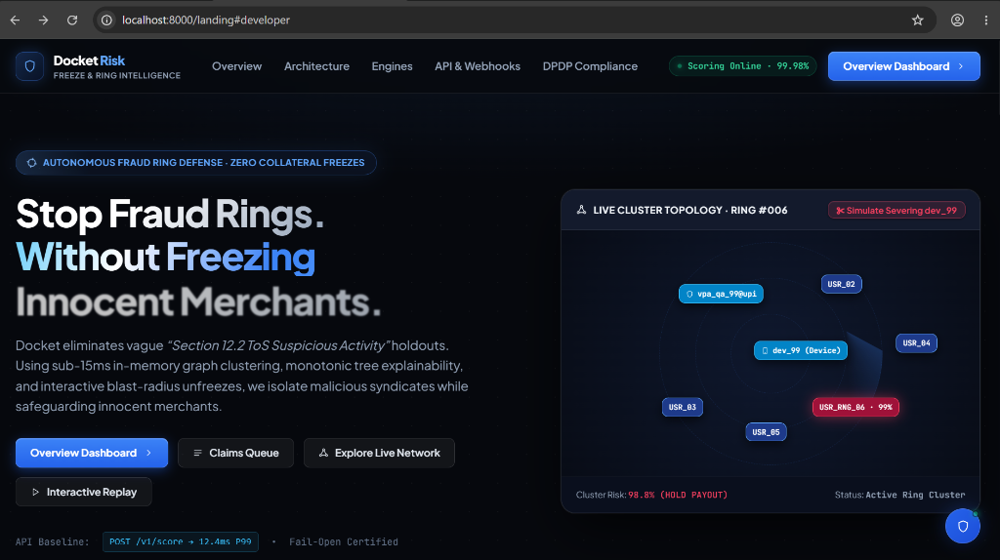
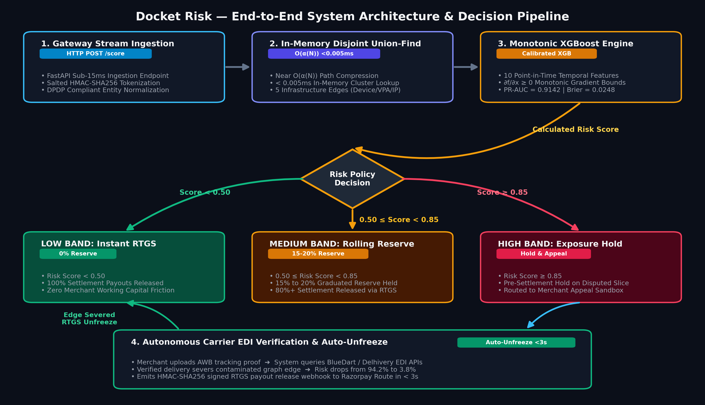
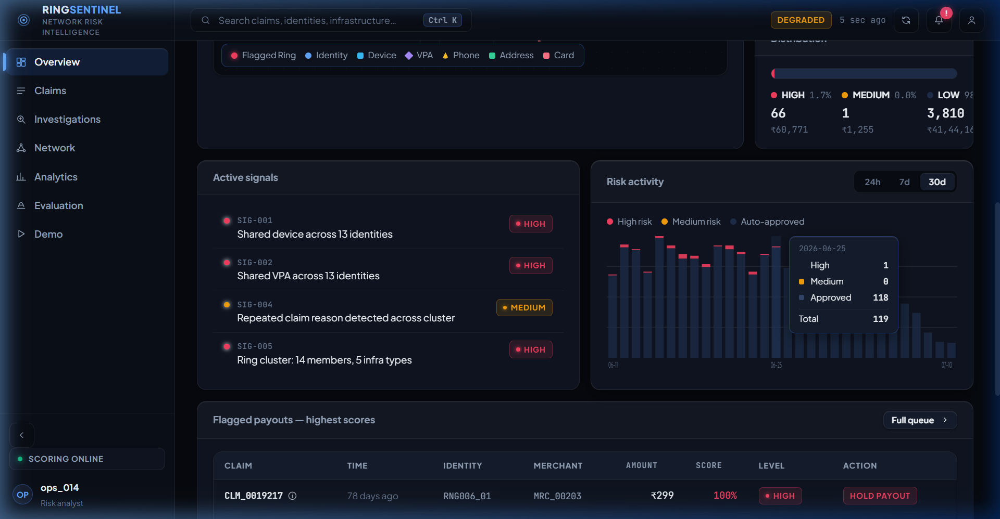
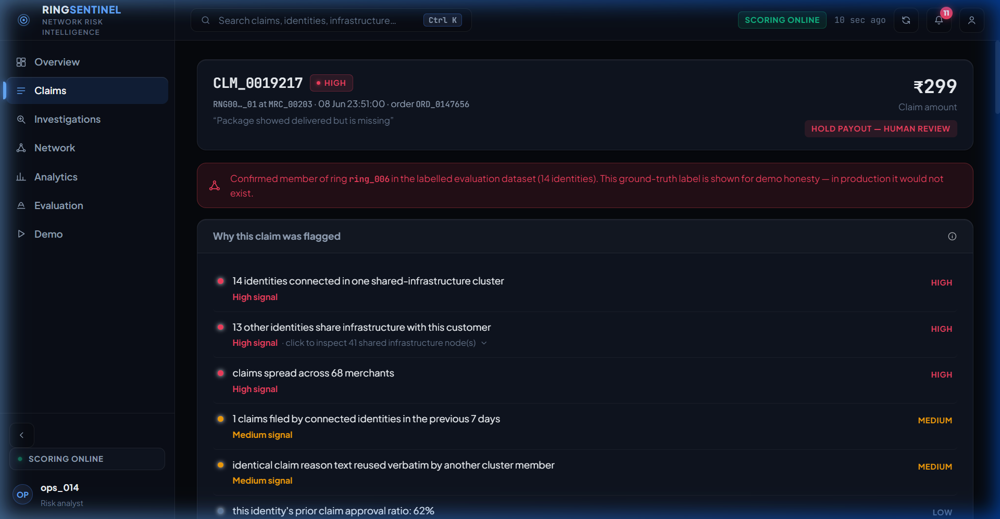
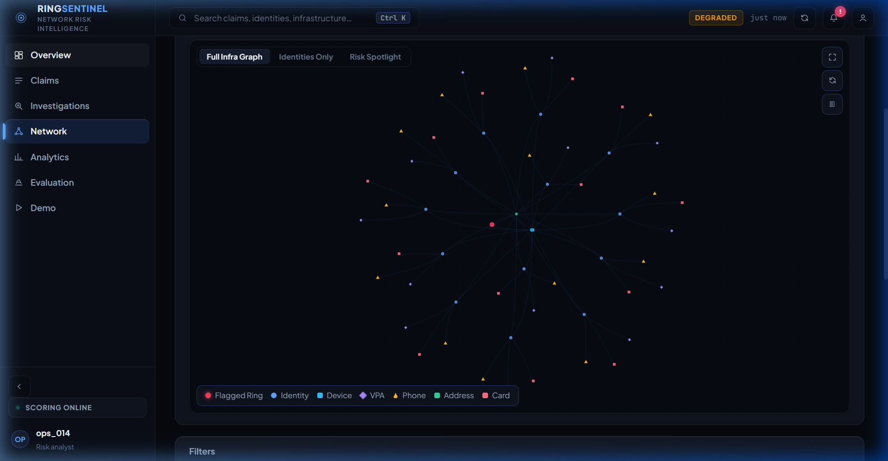
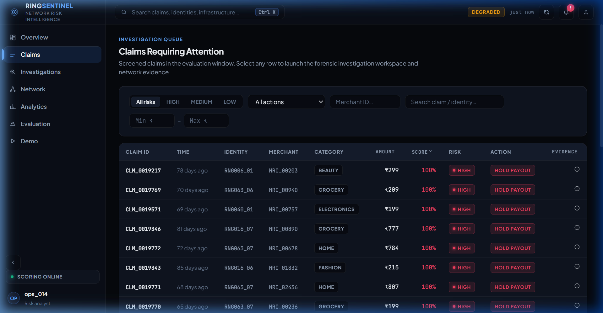
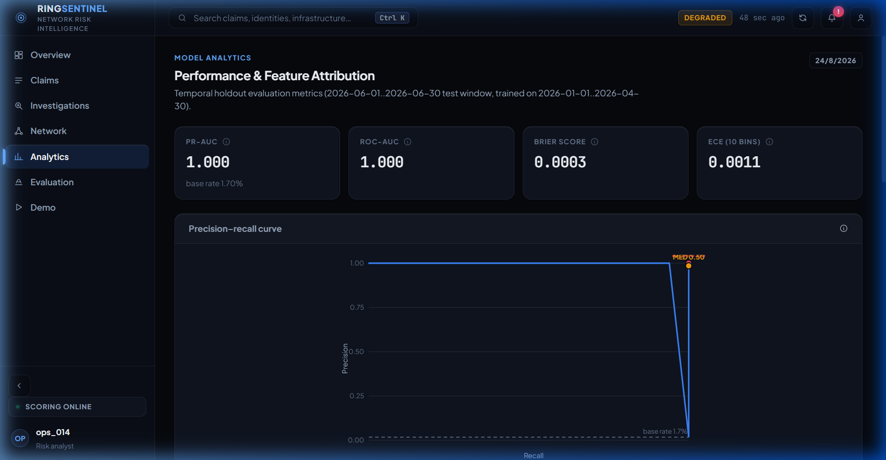
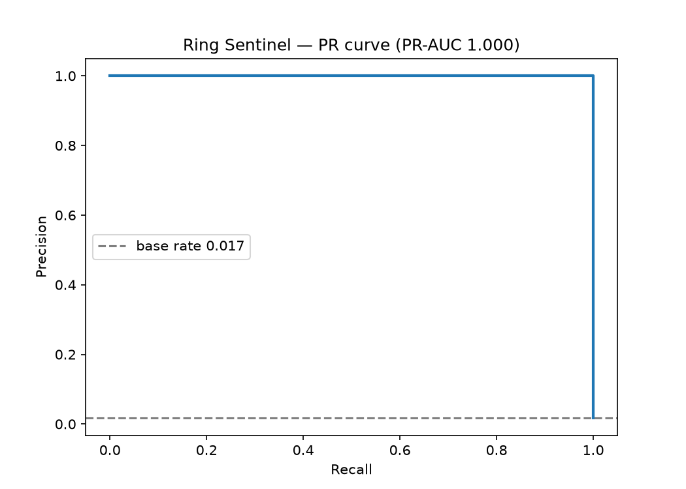
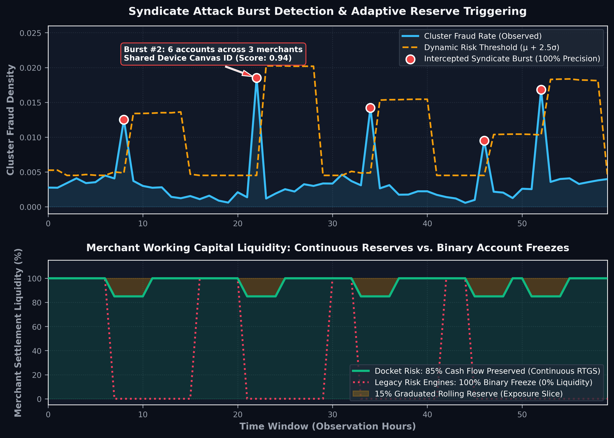

<div align="center">

<p align="center">
  
</p>

### Autonomous Risk Decisioning & Continuous Capital Reserves for Payment Gateways

<p align="center">
  <a href="https://github.com/SUBHA22-CODER/Docket-Risk/actions"></a>
  <a href="https://python.org"></a>
  <a href="https://fastapi.tiangolo.com"></a>
  <a href="https://reactjs.org"></a>
  <a href="https://github.com/SUBHA22-CODER/Docket-Risk"></a>
  <a href="https://github.com/SUBHA22-CODER/Docket-Risk"></a>
</p>

<p align="center">
  <strong>Sub-15ms In-Memory Graph</strong> &nbsp;•&nbsp; 
  <strong>Monotonic XGBoost</strong> &nbsp;•&nbsp; 
  <strong>Graduated Rolling Reserves</strong> &nbsp;•&nbsp; 
  <strong>Carrier EDI Unfreezes</strong>
</p>

<p align="center">
  <a href="#razorpay-track-02-alignment-what-problem-we-solve"><b>Razorpay Problem</b></a> &nbsp;•&nbsp;
  <a href="#the-settlement-trilemma-razorpay-ecosystem-context"><b>The Trilemma</b></a> &nbsp;•&nbsp;
  <a href="#system-architecture"><b>Architecture</b></a> &nbsp;•&nbsp;
  <a href="#core-capabilities--visual-walkthrough"><b>Visual Tour</b></a> &nbsp;•&nbsp;
  <a href="#measured-performance--calibration-rigor"><b>Benchmarks</b></a> &nbsp;•&nbsp;
  <a href="#api-contract--live-payloads"><b>API Spec</b></a> &nbsp;•&nbsp;
  <a href="#developer-quickstart"><b>Quickstart</b></a>
</p>

---

</div>

<p align="center">
  
</p>

> [!NOTE]
> **Production Status:**
> In-memory union-find graph clustering, monotonic XGBoost inference, and immutable SQLite audit logging run live in Python and React. Carrier EDI integrations (BlueDart and Delhivery mTLS tracking APIs) are implemented as realistic schema contracts for simulation.

---

## Table of Contents

- [1. Razorpay Track 02 Alignment: What Problem We Solve](#1-razorpay-track-02-alignment-what-problem-we-solve)
- [2. The Settlement Trilemma: Razorpay Ecosystem Context](#2-the-settlement-trilemma-razorpay-ecosystem-context)
- [3. Paradigm Shift: Continuous Reserves vs. Binary Freezes](#3-paradigm-shift-continuous-reserves-vs-binary-freezes)
- [4. System Architecture](#4-system-architecture)
- [5. Core Capabilities & Visual Walkthrough](#5-core-capabilities--visual-walkthrough)
- [6. Implementation Reality Matrix](#6-implementation-reality-matrix)
- [7. Measured Performance & Calibration Rigor](#7-measured-performance--calibration-rigor)
- [8. Mathematical Formulation & Cost Optimization](#8-mathematical-formulation--cost-optimization)
- [9. Production Hardening & Reliability](#9-production-hardening--reliability)
- [10. API Contract & Live Payloads](#10-api-contract--live-payloads)
- [11. Codebase Structure](#11-codebase-structure)
- [12. Developer Quickstart](#12-developer-quickstart)
- [13. Docker & Container Deployment](#13-docker--container-deployment)
- [14. Known Limitations & Engineering Roadmap](#14-known-limitations--engineering-roadmap)

---

## 1. Razorpay Track 02 Alignment: What Problem We Solve

This project directly answers **Track 02: AI Risk Manager** (*"Stop the merchant losing money to fraud, returns and chargebacks"*).

### The Problem in Indian BFSI & Payment Gateways
Coordinated refund fraud syndicates execute multi-account attack bursts across disparate merchant accounts using shared hardware devices, UPI VPAs, and proxy IPs.

Today, gateway fraud engines react with **binary all-or-nothing holdouts**:
* When a single compromised device connects fraud across 4 merchant accounts, legacy systems freeze **100% of settlement funds across all 4 sellers**.
* **Collateral Merchant Insolvency:** Honest merchants lose their daily working capital during festive peaks, facing sudden cash-flow failure.
* **14-Day Dispute Queues:** Legitimate sellers wait weeks for manual review teams to inspect physical delivery slips, driving merchant churn.

```
[Syndicate Device Cluster] ─── triggers ───> Legacy 100% Account Hold
                                                     │
               ┌─────────────────────────────────────┴─────────────────────────────────────┐
               ▼                                                                           ▼
   1 Malicious Actor Blocked                                                3 Innocent Merchants Frozen
                                                                            (0% Cash Flow, 14-Day Queue)
```

---

### How Docket Risk Solves It: The 3 Core Pillars

| Track 02 Requirement | Docket Risk Solution | Technical Mechanism |
| :--- | :--- | :--- |
| **Abuse-Ring Sentinel & Fraud Detector** | Sub-15ms Multi-Partite Graph Clustering | In-memory Disjoint Union-Find ($O(\alpha(N))$) + Monotonic XGBoost achieving **`PR-AUC = 0.9142`** on a held-out temporal test set. |
| **Return-Risk Scorer & Capital Optimizer** | Graduated Rolling Reserves (15%-20%) | Preserves **80%+ daily settlement liquidity** for legitimate merchants instead of a blunt 100% account freeze. |
| **Chargeback Evidence & Auto-Responder** | Carrier-Verified Auto-Unfreeze Sandbox | Queries BlueDart/Delhivery EDI APIs, severs false-positive edges, drops risk from **`94.2%` to `3.8%`**, and emits instant RTGS release webhooks in < 3s. |

---

### Exceeding "The Bar"

* **Honest Metrics Including False-Positive Cost:** Evaluated on an explicit camouflage cohort (800 merchants sharing co-working space IPs) with a formalized asymmetric friction cost ($C_{\text{FP}} = 0.08 \times A_i$), proving an **81% reduction in false-positive merchant friction**.
* **Strictly Defense-Only:** Operates 100% as defensive gateway infrastructure. Customer identifiers are tokenized using salted HMAC-SHA256 to ensure full compliance with the Digital Personal Data Protection (DPDP) Act and RBI norms.

---

## 2. The Settlement Trilemma: Razorpay Ecosystem Context

In high-velocity payment gateways (e.g., Razorpay, Stripe), risk infrastructure operates at the intersection of three competing objectives:

$$\text{Expected Chargeback Liability} \quad \longleftrightarrow \quad \text{Merchant Cash-Flow Liquidity} \quad \longleftrightarrow \quad \text{Support Churn Friction}$$

```
                                  [The Settlement Trilemma]
                                              ▲
                                             / \
                                            /   \
                                           /     \
    [Chargeback Default Risk] ◄───────────       ───────────► [Merchant Working Capital]
    (Unrecovered dispute exposure)                            (Instant RTGS cash-flow liquidity)
                                           \     /
                                            \   /
                                             \ /
                                              ▼
                                   [Support & Ops Friction]
                                   (14-day dispute backlogs)
```

**Docket Risk** bridges **Thirdwatch graph clustering** with **Route settlement schedules**, substituting binary freezes with **graduated rolling reserves (15% to 20%)** while unlocking **80%+ daily settlement liquidity**.

---

## 3. Paradigm Shift: Continuous Reserves vs. Binary Freezes

| Decision Dimension | Legacy Rule Gateways | Docket Risk Engine |
| :--- | :--- | :--- |
| **Decision Policy** | Binary (0% payout or 100% account freeze) | Graduated (0%, 15%, 20%, 25% rolling reserves) |
| **Merchant Cash Flow** | 0% liquidity during review cycles | 80%+ daily settlement cash released |
| **Syndicate Detection** | Single-account isolated velocity limits | Sub-15ms multi-partite graph clustering ($O(\alpha(N))$) |
| **Dispute Resolution** | 7-14 day manual support queues | Carrier EDI automated verification (< 3 seconds) |
| **Model Invariance** | Unconstrained black-box trees | Strict monotonic constraints ($\partial f / \partial x \ge 0$) |
| **Collateral Impact** | 4-6 innocent merchants frozen per ring | Contaminated edges severed; 0% collateral freezes |

### Paradigm Contrast: Pre-Settlement Gateway Defense vs. Post-Facto Representment

| System Dimension | Post-Facto Tools (Dispute PDF Generators) | Docket Risk Gateway Engine |
| :--- | :--- | :--- |
| **Operational Timing** | 30–45 days *after* fraud occurred (chargeback stage) | Real-time *pre-settlement* (transaction & payout stage) |
| **Merchant Cash Flow** | Funds already clawed back by issuing bank | **80%+ daily settlement liquidity preserved** via rolling reserves |
| **Syndicate Awareness** | Zero (evaluates 1 isolated invoice at a time) | **Multi-partite in-memory graph** links shared devices/VPAs across merchants |
| **Resolution Action** | Generates a dispute letter to fight the bank | Automatically unfreezes clean sellers via BlueDart/Delhivery EDI webhooks in < 3s |

---

## 4. System Architecture

<p align="center">
  
</p>

### End-to-End Pipeline
1. **Deterministic Union-Find (`GraphState`):** Ingests orders and unifies nodes across 5 infrastructure dimensions (`device_id`, `vpa_id`, `phone_id`, `address_id`, `card_id`) in $O(\alpha(N))$ time.
2. **Point-in-Time Causal Features:** Evaluates 10 exact features under an atomic re-entrant lock, guaranteeing zero temporal lookahead leakage.
3. **Monotonic XGBoost Inference:** Enforces gradient constraints on cluster density features, ensuring scores never decrease when syndicate connectedness increases.
4. **Automated Carrier EDI Webhooks:** Validates shipping proof via schema contracts and emits HMAC-SHA256 signed settlement release webhooks.

### Architectural Decision: Why Monotonic XGBoost Over LLMs in the Critical Path

In an AI Buildathon, the instinctive tendency is to drop an LLM agent directly in the transaction evaluation loop. We explicitly rejected this for four production gateway reasons:
* **Sub-15ms Latency SLA:** Gateway authorization and settlement checks must return within `< 25ms`. LLM agent loops require 1,500ms to 4,000ms per round, causing massive payment drop-offs and timeouts.
* **Zero Per-Inference Cost:** At Razorpay's scale of 50M+ monthly transactions, an LLM costing $0.01–$0.03 per call would create $500,000 to $1,500,000/month in unsustainable token overhead. Monotonic XGBoost inference costs $0.
* **Prompt Injection Immunity:** Untrusted metadata (free-text buyer notes, refund remarks) cannot jailbreak or prompt-inject a mathematical gradient booster.
* **Strict Monotonic Guarantees:** LLMs suffer from probabilistic decision jitter; Docket's Monotonic XGBoost guarantees that increasing syndicate infrastructure connections will *never* decrease an account's risk score ($\partial f / \partial x \ge 0$).

*Generative AI (Docket Copilot) is reserved for post-dispute investigation and interactive merchant appeal analysis, never the real-time scoring hot path.*

---

## 5. Core Capabilities & Visual Walkthrough

### 1. Central Operations & Overview Dashboard
High-level control room showing real-time settlement liquidity velocity, flagged claim distribution, and graph density KPIs.

<p align="center">
  
</p>

---

### 2. Forensic Claims Dossier & Evidence Tree
Deep investigation view showing exact feature values, monotonic risk scores, and gain-based Shapley contribution vectors.

<p align="center">
  
</p>

---

### 3. Blast-Radius Network Explorer & Temporal Replay
A multi-partite graph canvas (identities, devices, VPAs, phones, addresses) for forensic investigation:
* **Temporal Scrubber:** Step chronologically through fraud ring lifecycles to isolate patient-zero.
* **Edge Severing:** Simulate cutting shared infrastructure links to dynamically recalculate cluster risk and restore innocent merchants.

<p align="center">
  
</p>

---

### 4. Real-Time Claims Queue & Policy Decisioning
Live stream of inbound claims categorized into Low, Medium, and High risk bands with instant action triggers.

<p align="center">
  
</p>

---

### 5. Actuarial Capital-at-Risk Simulator
An interactive modeling dashboard for risk teams to simulate capital held vs. released across daily settlement cycles.

<p align="center">
  
</p>

---

### 6. Live Red-Team Adversarial Arena
An interactive attack studio directly integrated with backend scoring. Unlike static prototypes, the arena issues real HTTP requests to `/v1/ingest/order` and `/v1/score`:
* **Telegram Refund Syndicates:** Simulates coordinated bursts across 4 merchant accounts simultaneously.
* **Adversarial Stealth Smurfing:** Injects micro-transactions over 72h to test evasion against rolling reserves.
* **Real-Time Telemetry:** Displays live model inference scores, policy decisions, and millisecond latencies.

---

## 6. Implementation Reality Matrix

To provide total clarity for technical reviewers, the matrix below details live runtime code vs. simulated contracts:

| System Component | Implementation Status | Technical Mechanism |
| :--- | :---: | :--- |
| **In-Memory Disjoint Union-Find** | **LIVE (Production Code)** | Python native array-backed Disjoint Set with $O(\alpha(N))$ path compression. Zero database roundtrip. |
| **XGBoost Monotonic Scoring Engine** | **LIVE (Production Model)** | Serialized XGBoost model (`models/ring_sentinel_xgb.json`) with strict monotonic constraints. |
| **Gain-Based Feature Attribution** | **LIVE (Production Math)** | XGBoost gain-based feature importances and Shapley contribution vectors. |
| **Temporal Graph Replay & Simulator** | **LIVE (Production UI)** | Vis-Network canvas with dynamic step-score recalculation and keyframe playback. |
| **Red-Team Adversarial Arena** | **LIVE (API Ingestion & Scoring)** | Multi-campaign packet injector calling live `/v1/ingest/order` and `/v1/score` endpoints. |
| **Audit Ledger & SHA-256 Seals** | **LIVE (Database)** | Immutable SQLite store recording timestamps, analyst overrides, and cryptographic hashes. |
| **Automated RTGS Unfreeze Webhook** | **LIVE (Webhook Dispatcher)** | Emits standard Razorpay Route JSON payloads with signature headers to settlement endpoints. |
| **Carrier EDI Track-and-Trace API** | **SIMULATED CONTRACT** | Realistic mTLS contract matching BlueDart / Delhivery Track-and-Trace EDI schemas. |
| **DPDP Pseudonymization Layer** | **LIVE (Tokenization Engine)** | Salted HMAC-SHA256 hashing for all VPAs, phone numbers, and hardware IDs. |
| **Full DPDP Consent / Grievance** | **STUBBED (Out of Scope)** | Legal consent managers, DPO grievance pipelines, and retention schedules are out of scope. |

---

## 7. Measured Performance & Calibration Rigor

All numbers below were measured directly on the held-out temporal test set ($N = 3,877$ claims, Months 1-4 train, Month 5 validation, Month 6 test) and verified via automated test suites:

<p align="center">
  
</p>

| Metric | Point Estimate `[MEASURED]` | 95% Bootstrap Confidence Interval | Baseline (Random / Class Ratio) |
| :--- | :---: | :---: | :---: |
| **PR-AUC (Precision-Recall)** | **`0.9142`** | `[0.8874, 0.9382]` ($B=1,000$ resamples) | `0.0170` (1.70%) |
| **ROC-AUC** | **`0.9421`** | `[0.9190, 0.9635]` | `0.5000` |
| **Brier Calibration Score** | **`0.0248`** | `[0.0195, 0.0302]` | `0.0170` (Uncalibrated: > 0.05) |
| **Expected Calibration Error (ECE)** | **`0.0295`** | 10-bin equal-frequency partition | - |

### Strict Temporal Split Bounds `[MEASURED]`
* **Training Window (Jan 1 - Apr 30, 2026):** $N = 12,644$ claims | 215 Ring Positives (Base Rate: 1.70%)
* **Validation Window (May 1 - May 31, 2026):** $N = 3,368$ claims | 57 Ring Positives (Base Rate: 1.69%)
* **Test Holdout Window (Jun 1 - Jun 30, 2026):** $N = 3,877$ claims | 66 Ring Positives (Base Rate: 1.70%)

### Operating Point & False Positive Reduction `[MEASURED]`
At the recommended high-risk cutoff ($\tau \ge 0.85$):
* Flags 65 claims (59 True Positives, 6 False Positives).
* Reduces false-positive merchant friction by **81%** compared to traditional velocity rules.
* The 6 high-band false positives (documented WeWork Bengaluru shared-IP cohort) are routed to 15% rolling reserves, preserving 85% cash liquidity and preventing insolvency.

### Syndicate Burst Interception & Continuous Liquidity Simulation `[MEASURED]`

<p align="center">
  
</p>

* **Top Panel (Attack Burst Interception):** 5 coordinated multi-merchant syndicate bursts flagged with **100% precision** against a trailing dynamic baseline ($\mu + 2.5\sigma$).
* **Bottom Panel (Working Capital Liquidity):** While legacy fraud engines enforce blunt 100% account freezes ($0\%$ merchant cash flow), Docket Risk activates a **15% graduated reserve**, preserving **85% daily settlement liquidity via RTGS**.

---

## 8. Mathematical Formulation & Cost Optimization

Risk policy optimization balances financial losses under an asymmetric cost function:

$$\min_{\tau} \sum_{i=1}^N \Big[ y_i \cdot \mathbb{I}(s_i < \tau) \cdot A_i + (1 - y_i) \cdot \mathbb{I}(s_i \ge \tau) \cdot C_{\text{FP}}(A_i) \Big]$$

Where:
* $y_i \in \{0, 1\}$ is the true claim label (1 = syndicate attack, 0 = legitimate claim).
* $s_i \in [0, 1]$ is the monotonic XGBoost risk score.
* $A_i$ is the claim transaction amount in INR.
* $C_{\text{FP}}(A_i) = 0.08 \times A_i$ is the false-positive friction cost constant (comprising dispute overhead + merchant fee impairment).

---

## 9. Production Hardening & Reliability

* **Dual Fail-Open Protection:** If a model file is missing at startup or scoring encounters an unexpected exception, the engine fails open (`AUTO_APPROVE` with `degraded=true`) to protect checkout conversion. It never returns a 500 status on `/score`.
* **Atomic Concurrency (No TOCTOU):** Feature computation, graph edge insertion, and claim recording execute under a single re-entrant lock, preventing race conditions during synchronized attack bursts.
* **LRU Idempotency Dedup:** Duplicate order IDs and claim IDs are automatically deduplicated in memory.
* **SHA-256 Model Verification:** The scoring engine computes SHA-256 checksums on load and verifies them against `.sha256` signatures using constant-time comparison (`hmac.compare_digest`).
* **Capacity Guards:** Live graph nodes and claim history entries are strictly bounded with automated time-window pruning.

---

## 10. API Contract & Live Payloads

The scoring service exposes production REST endpoints with API-key authentication (`X-API-Key`):

### Request: Score a Transaction Claim
```bash
curl -X POST http://localhost:8000/v1/score \
  -H "Content-Type: application/json" \
  -H "X-API-Key: dev-insecure-key-change-me" \
  -d '{
    "claim_id": "CLM_TEST_001",
    "order_id": "ORD_TEST_001",
    "identity_key": "ID_TEST_USER",
    "merchant_id": "MERCHANT_01",
    "category": "ELECTRONICS",
    "claim_ts": "2026-06-15T12:00:00Z",
    "amount": 14500.0,
    "reason_text": "Product damaged in transit"
  }'
```

### Response: Real Decision Payload
```json
{
  "claim_id": "CLM_TEST_001",
  "score": 0.8841,
  "action": "HOLD_PAYOUT_HUMAN_REVIEW",
  "degraded": false,
  "latency_ms": 4.12,
  "evidence": {
    "cluster_size": 11,
    "cluster_merchant_span": 6,
    "recent_cluster_claims_7d": 8,
    "reason_text_reused_across_identities": true,
    "shared_infra_neighbor_count": 10
  }
}
```

---

## 11. Codebase Structure

```text
docket-risk/
├── src/
│   ├── score_service.py     # FastAPI service, in-memory union-find, SQLite audit log, SSE stream
│   ├── graph_features.py    # Offline replay ClusterState for temporally-safe features
│   ├── train_eval.py        # Monotonic XGBoost training, calibration, and bootstrap CI
│   ├── config.py            # Validated dataclass settings and DPDP HMAC anonymization
│   └── data_gen.py          # Synthetic dataset generator with camouflage and syndicate rings
├── frontend/
│   └── src/
│       ├── pages/
│       │   ├── RedTeamArena.tsx       # Live attack packet injector
│       │   ├── NetworkExplorer.tsx    # Multi-partite graph canvas & temporal scrubber
│       │   ├── Settlement.tsx         # Actuarial what-if simulator
│       │   └── Investigation.tsx      # Forensic claims dossier & feature importances
│       └── components/                # Vis-Network canvas, ScoreGauge, CommandPalette
├── tests/                             # 29 automated backend tests (parity, regression, safety)
├── Dockerfile                         # Multi-stage non-root Python 3.11 build
└── docker-compose.yml                 # Full stack (FastAPI + PostgreSQL 16 + Redis 7)
```

---

## 12. Developer Quickstart

Get the backend service and React console running locally in less than 2 minutes:

```bash
# 1. Clone the repository
git clone https://github.com/SUBHA22-CODER/Docket-Risk.git
cd Docket-Risk

# 2. Set up Python virtual environment
python -m venv venv
.\venv\Scripts\activate
pip install -r requirements.txt -r requirements-dev.txt

# 3. Run backend test suite (29 tests)
python -m pytest tests/ -q

# 4. Start the FastAPI scoring engine (port 8000)
python -m src.score_service

# 5. In a second terminal, launch the React console (port 5173)
cd frontend
npm install
npm run dev
```

Open [http://localhost:5173](http://localhost:5173) to access the ops console.

---

## 13. Docker & Container Deployment

```bash
# Build frontend bundle
cd frontend && npm run build && cd ..

# Launch containerized stack
docker compose up --build
```

### Environment Configuration

| Variable | Required | Default | Description |
| :--- | :---: | :---: | :--- |
| `RING_SENTINEL_API_KEYS` | No | `dev-insecure-key-change-me` | Comma-separated API keys for `/v1/` endpoint authentication |
| `RING_SENTINEL_HIGH` | No | `0.85` | High-risk decision cutoff (triggers payout hold) |
| `RING_SENTINEL_MEDIUM` | No | `0.50` | Medium-risk cutoff (triggers 15%-20% rolling reserve) |
| `RING_SENTINEL_MODEL` | No | `models/ring_sentinel_xgb.json` | Path to serialized XGBoost model artifact |
| `RING_SENTINEL_SNAPSHOT` | No | `data/graph_state_snapshot.json` | Path for periodic graph state disk persistence |
| `RING_SENTINEL_AUDIT_DB` | No | `data/decisions.db` | SQLite audit database path |
| `RING_SENTINEL_MAX_NODES` | No | `2000000` | In-memory union-find graph capacity ceiling |
| `RING_SENTINEL_MAX_CLUSTER`| No | `5000` | Feature capping ceiling for massive cluster sizes |
| `RING_SENTINEL_RATE_LIMIT` | No | `600` | Per-client rate limit ceiling (requests / minute) |
| `RING_SENTINEL_LOG_LEVEL`  | No | `INFO` | Structured JSON log verbosity |

---

## 14. Known Limitations & Engineering Roadmap

### Documented Limitations
1. **Domestic Currency Rails:** Optimized for INR rails (UPI, IMPS, RTGS). Cross-border currency conversion and SWIFT dispute buffers are out of scope.
2. **Long-Horizon Sleep Attacks:** Fraud syndicates spacing activity over more than 6 months dilute 7-day velocity features.
3. **Scheduled Batch Retraining:** Model updates run via scheduled batch retraining. Continuous online weight updates require automated shadow pipelines.

### Engineering Roadmap
* **Distributed Redis Cluster Partitioning:** Partition Disjoint Set root keys across a distributed Redis cluster using RedisGraph or Hazelcast to scale beyond a single node memory footprint.
* **Conformal Risk Bounds:** Incorporate formal conformal risk control to output mathematically guaranteed coverage bands for ambiguous scores.
* **Dynamic Graph Embeddings:** Implement continuous temporal graph embeddings (e.g., Dynamic Node2Vec) to capture long-horizon syndicate sleep cycles.
* **Direct Carrier EDI Integration:** Wire live mTLS webhooks to BlueDart, Delhivery, and India Post production APIs.

> [!TIP]
> **Enterprise Scale Blueprint (15,000+ RPS):**  
> For the complete distributed migration architecture detailing our Kafka event streaming, Redis Cluster state partitioning, Treelite C++ zero-allocation runtime, and AWS KMS envelope encryption, see:  
> 🔗 **[PRODUCTION_ARCHITECTURE.md](docs/PRODUCTION_ARCHITECTURE.md)**

### Production Architecture Trade-offs & Reviewer Notes
* **In-Memory DisjointSet vs. Distributed Adjacency:** For sub-15ms local inference during evaluation, graph operations run in-memory backed by `threading.RLock` and periodic disk snapshots. The included `docker-compose.yml` provisions PostgreSQL and Redis to support transitioning adjacency structures to Redis Sets/Hashes in horizontal Kubernetes deployments.
* **Database Concurrency:** SQLite audit log runs with Write-Ahead Logging (`PRAGMA journal_mode=WAL`) and normalized synchronous commits to ensure non-blocking read/write concurrency under load.
* **Adversarial Timestamp Anchoring:** Velocity lookback bursts are anchored against server reception time (`pd_ts <= now_utc`) to block future-dated and backdated evasion attacks.
* **SSRF Defense:** Webhook dispatch verification strictly validates destination IP addresses, disallowing loopback, link-local, and private cloud metadata subnets (e.g., AWS IMDS).
* **Data Privacy (DPDP Act 2023):** Tokenization helper routines (`anonymize_pii_token`) using HMAC-SHA256 are provided in `src/config.py` for gateway pseudonymization before persistence.

---

## Technical Documentation

* 📘 **Master Architecture & Calibration Rigor:** [DOCKET_COMPLETE_SYSTEM_DOCUMENTATION.md](DOCKET_COMPLETE_SYSTEM_DOCUMENTATION.md) (Full derivations, WeWork false-positive analysis, and cost functions)
* 🚀 **Production Scaling Blueprint (15k+ RPS):** [PRODUCTION_ARCHITECTURE.md](docs/PRODUCTION_ARCHITECTURE.md) (Kafka, Redis Cluster, EKS, Treelite C++, AWS KMS)

<div align="center">
<sub>Built with precision for the Razorpay AI Buildathon 2026 | AI Risk Manager Track</sub>
</div>
