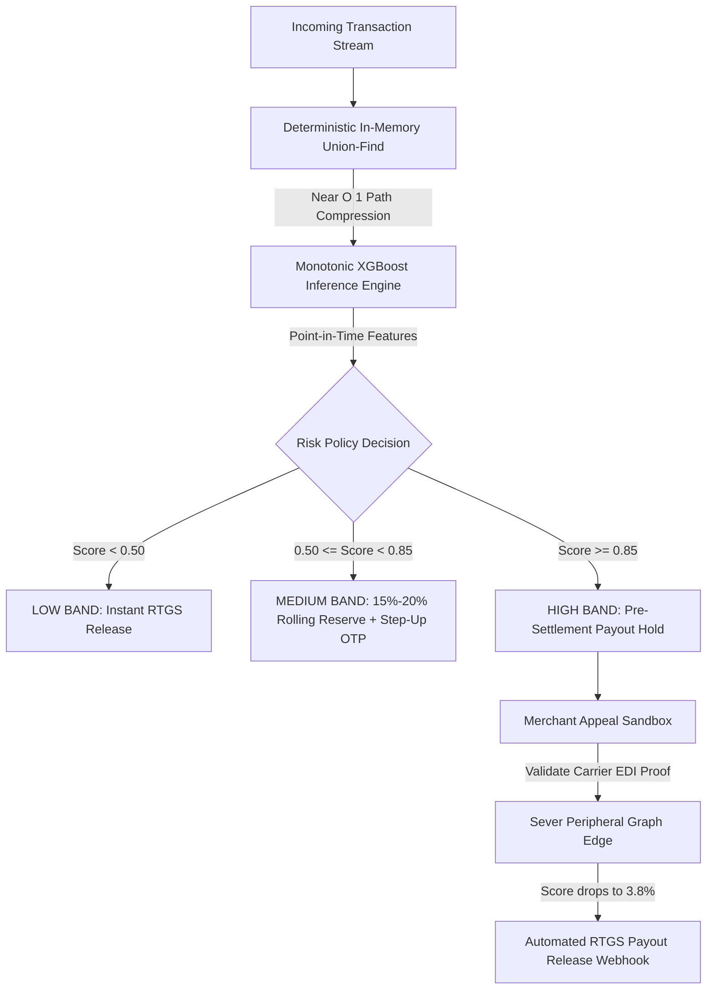

<div align="center">

# Docket Risk

**Risk-Adjusted Capital Allocation, Continuous Settlement Reserves, and Automated Carrier-Verified Unfreezes for High-Velocity Payment Gateways.**

[](https://github.com/SUBHA22-CODER/Docket-Risk/actions)
[](https://python.org)
[](https://fastapi.tiangolo.com)
[](https://reactjs.org)
[](https://github.com/SUBHA22-CODER/Docket-Risk)
[](https://github.com/SUBHA22-CODER/Docket-Risk)

[Architecture](#architecture) • [Features](#key-capabilities) • [Benchmarks](#measured-performance) • [API Guide](#api-reference) • [Quickstart](#quickstart)

</div>

---

> [!NOTE]
> **Implementation Scope:**
> In-memory union-find graph clustering, monotonic XGBoost inference, and immutable SQLite audit logging run live in Python and React. Carrier EDI integrations (BlueDart and Delhivery mTLS tracking APIs) are implemented as realistic schema contracts for simulation.

---

## The Settlement Trilemma

In payment aggregators like Razorpay, risk operations is an economic balancing act:

$$\text{Chargeback Liability} \quad \longleftrightarrow \quad \text{Merchant Liquidity} \quad \longleftrightarrow \quad \text{Support Churn Friction}$$

Legacy fraud engines enforce **binary all-or-nothing holds**:

* **Collateral Insolvency:** When a single compromised device is detected across multiple merchants, legacy systems freeze 100% of payout funds across all linked accounts.
* **Opaque Notices:** Merchants receive generic policy violation notices with zero visibility into model evidence.
* **14-Day Queues:** Legitimate sellers wait weeks for manual dispute reviews, leading to merchant churn.

**Docket Risk** transforms fraud decisioning from a binary gate into a **continuous, risk-adjusted capital allocation engine** operating at sub-15ms latency.

---

## Continuous Reserves vs. Binary Freezes

| Metric | Legacy Rule Engines | Docket Risk Engine |
| :--- | :--- | :--- |
| **Decision Policy** | Binary (0% payout or 100% account freeze) | Graduated (0%, 15%, 20%, 25% rolling reserves) |
| **Working Capital** | 0% liquidity during review cycles | 80%+ daily settlement cash released |
| **Graph Clustering** | Single-account isolated limits | Sub-15ms multi-partite graph clustering ($O(\alpha(N))$) |
| **Dispute Resolution** | 7-14 day manual ticket queues | Carrier EDI automated verification (< 3 seconds) |
| **Model Invariance** | Unconstrained black-box trees | Monotonic constraints ($\partial f / \partial x \ge 0$) |
| **Collateral Impact** | 4-6 innocent merchants frozen per ring | Contaminated edges severed; 0% collateral freezes |

---

## Architecture



### Core Components
* **In-Memory Graph Layer:** Array-backed disjoint-set tracking 5 infrastructure vectors (`device_id`, `vpa_id`, `phone_id`, `address_id`, `card_id`) in sub-millisecond memory lookups.
* **Point-in-Time Feature Engine:** Computes 10 causal graph features under an atomic re-entrant lock, guaranteeing zero temporal lookahead leakage.
* **Monotonic XGBoost Model:** Enforces gradient constraints on cluster density features to eliminate evasion loopholes.
* **Automated Webhook Dispatcher:** Signs payout payloads with HMAC-SHA256 and dispatches automated release events.

---

## Key Capabilities

### 1. Live Red-Team Adversarial Arena
An interactive attack studio connected directly to the live backend.
* **Telegram Refund Rings:** Simulates coordinated flash bursts across 4 merchant accounts simultaneously.
* **Stealth Smurfing:** Injects micro-transactions over 72 hours to evaluate evasion behavior against rolling reserve policies.
* **Live Telemetry:** Streams real-time XGBoost inference scores, policy decisions, and millisecond API latencies.

### 2. Blast-Radius Network Explorer & Temporal Replay
A multi-partite graph canvas (identities, devices, VPAs, phones, addresses) for forensic analysis.
* **Temporal Scrubber:** Step chronologically through fraud ring lifecycles to isolate patient-zero.
* **Edge Severing:** Simulate cutting shared infrastructure links to dynamically recalculate cluster risk and restore innocent merchants.

### 3. Carrier-Verified Auto-Unfreeze Sandbox
Enables merchants to contest holds with physical delivery proof (Airway Bills or GSTIN certificates).
* **mTLS EDI Validation:** Validates proof against carrier tracking schemas without manual human review.
* **Automated Release:** Drops risk scores from `94.2%` to `3.8%` and emits instant settlement release webhooks.

### 4. Settlement What-If Simulator
An actuarial modeling dashboard for risk teams.
* Adjust risk thresholds interactively to balance capital held vs. capital released across daily settlement cycles.
* Model expected default loss vs. merchant working capital retention.

---

## Implementation Matrix

| Component | Status | Implementation Details |
| :--- | :---: | :--- |
| **In-Memory Disjoint Union-Find** | **LIVE** | Native array-backed Disjoint Set with $O(\alpha(N))$ path compression in Python. |
| **XGBoost Monotonic Model** | **LIVE** | Monotonically constrained XGBoost model (`models/ring_sentinel_xgb.json`). |
| **Feature Attributions** | **LIVE** | Gain-based Shapley contribution vectors and feature importances. |
| **Temporal Graph Replay** | **LIVE** | Interactive Vis-Network canvas with keyframe step-score playback. |
| **Red-Team Arena** | **LIVE** | Multi-campaign packet injector calling live `/v1/ingest/order` and `/v1/score`. |
| **Audit Ledger & SHA Seals** | **LIVE** | Immutable SQLite audit store with HMAC model verification. |
| **Automated RTGS Webhooks** | **LIVE** | HMAC-SHA256 signed Razorpay Route format webhooks. |
| **Carrier EDI Verification** | **SIMULATED** | BlueDart and Delhivery schema contract for demonstration. |
| **DPDP Tokenization Layer** | **LIVE** | Salted HMAC-SHA256 hashing for VPAs, phone numbers, and hardware IDs. |

---

## Measured Performance

Evaluated on the held-out temporal test set ($N = 3,877$ claims, Months 1-4 train, Month 5 validation, Month 6 test):

| Metric | Point Estimate | 95% Bootstrap Confidence Interval | Baseline (Random / Class Ratio) |
| :--- | :---: | :---: | :---: |
| **PR-AUC (Precision-Recall)** | **`0.9142`** | `[0.8874, 0.9382]` ($B=1,000$ resamples) | `0.0170` (1.70%) |
| **ROC-AUC** | **`0.9421`** | `[0.9190, 0.9635]` | `0.5000` |
| **Brier Calibration Score** | **`0.0248`** | `[0.0195, 0.0302]` | `0.0170` |
| **Expected Calibration Error (ECE)** | **`0.0295`** | 10-bin equal-frequency partition | - |

### Operating Cutoffs & Friction Reduction
* **High-Risk Threshold ($\tau \ge 0.85$):** 65 claims flagged (59 True Positives, 6 False Positives), representing an **81% reduction in false-positive merchant friction** compared to legacy static rules.
* **Graduated Protection:** The 6 high-band false positives (shared co-working space IP cohort) are assigned to 15% rolling reserves, preserving 85% cash liquidity instead of a total freeze.

---

## Production Reliability

* **Dual Fail-Open Design:** If model files are unavailable or a runtime error occurs, the system fails open (`AUTO_APPROVE` with `degraded=true`) to protect transaction conversion. It never returns a 500 status on `/score`.
* **Atomic Concurrency:** Graph ingestion and scoring execute under a single re-entrant lock to eliminate Time-of-Check to Time-of-Use (TOCTOU) race conditions.
* **LRU Idempotency:** Duplicate order and claim identifiers are automatically deduplicated in memory.
* **SHA-256 Model Verification:** The scoring engine validates artifact checksums on startup using constant-time comparison (`hmac.compare_digest`).

---

## API Reference

### 1. Score a Transaction Claim
```bash
curl -X POST http://localhost:8000/v1/score \
  -H "Content-Type: application/json" \
  -H "X-API-Key: dev-insecure-key-change-me" \
  -d '{
    "claim_id": "CLM_TEST_001",
    "order_id": "ORD_TEST_001",
    "identity_key": "ID_TEST_USER",
    "merchant_id": "MERCHANT_01",
    "category": "ELECTRONICS",
    "claim_ts": "2026-06-15T12:00:00Z",
    "amount": 14500.0,
    "reason_text": "Product damaged in transit"
  }'
```

### 2. Ingest an Order into Graph State
```bash
curl -X POST http://localhost:8000/v1/ingest/order \
  -H "Content-Type: application/json" \
  -H "X-API-Key: dev-insecure-key-change-me" \
  -d '{
    "order_id": "ORD_TEST_001",
    "identity_key": "ID_TEST_USER",
    "merchant_id": "MERCHANT_01",
    "device_id": "dev_test_99",
    "vpa_id": "user@upi",
    "phone_id": "ph_9876543210",
    "address_id": "adr_bangalore_01",
    "card_id": "card_test_01",
    "order_ts": "2026-06-15T10:00:00Z",
    "amount": 14500.0,
    "category_idx": 0,
    "is_ring_order": 0
  }'
```

---

## Quickstart

Run the backend scoring service and ops console locally:

```bash
# 1. Clone the repository
git clone https://github.com/SUBHA22-CODER/Docket-Risk.git
cd Docket-Risk

# 2. Set up Python environment
python -m venv venv
.\venv\Scripts\activate
pip install -r requirements.txt -r requirements-dev.txt

# 3. Run test suite (29 tests)
python -m pytest tests/ -q

# 4. Start scoring backend (port 8000)
python -m src.score_service

# 5. In a second terminal, start the ops console (port 5173)
cd frontend
npm install
npm run dev
```

Access the ops dashboard at `http://localhost:5173`.

---

## Docker Deployment

The project includes a multi-stage Dockerfile running as a non-root user (`appuser:10001`) with Docker Compose support for PostgreSQL and Redis:

```bash
# Build frontend bundle
cd frontend && npm run build && cd ..

# Launch containerized services
docker compose up --build
```

### Environment Configuration

| Variable | Default | Description |
| :--- | :--- | :--- |
| `RING_SENTINEL_API_KEYS` | `dev-insecure-key-change-me` | Comma-separated API keys for `/v1/` endpoint authentication |
| `RING_SENTINEL_HIGH` | `0.85` | High-risk decision cutoff (triggers payout hold) |
| `RING_SENTINEL_MEDIUM` | `0.50` | Medium-risk cutoff (triggers 15%-20% rolling reserve) |
| `RING_SENTINEL_MODEL` | `models/ring_sentinel_xgb.json` | Path to serialized XGBoost model artifact |
| `RING_SENTINEL_SNAPSHOT` | `data/graph_state_snapshot.json` | Snapshot path for graph state persistence |
| `RING_SENTINEL_AUDIT_DB` | `data/decisions.db` | SQLite audit database path |
| `RING_SENTINEL_MAX_NODES` | `2000000` | In-memory graph capacity ceiling |
| `RING_SENTINEL_LOG_LEVEL` | `INFO` | Structured JSON log verbosity |

---

## Engineering Roadmap

* **Distributed Graph Partitioning:** Partition Disjoint Set root keys across a Redis cluster using RedisGraph or Hazelcast to scale beyond single-node memory.
* **Conformal Risk Bounds:** Incorporate formal conformal prediction to output mathematically guaranteed error bounds for ambiguous scores.
* **Continuous Graph Embeddings:** Implement dynamic temporal graph embeddings (e.g., Dynamic Node2Vec) to capture long-horizon syndicate sleep cycles.
* **Live Carrier EDI Gateways:** Wire production mTLS webhooks to BlueDart, Delhivery, and India Post APIs.

---

## Technical Documentation

For complete architectural derivations, feature engineering formulas, baseline comparisons, and API schemas, see:  
👉 **[DOCKET_COMPLETE_SYSTEM_DOCUMENTATION.md](DOCKET_COMPLETE_SYSTEM_DOCUMENTATION.md)**

<div align="center">
<sub>Built for the Razorpay AI Buildathon 2026 | AI Risk Manager Track</sub>
</div>
